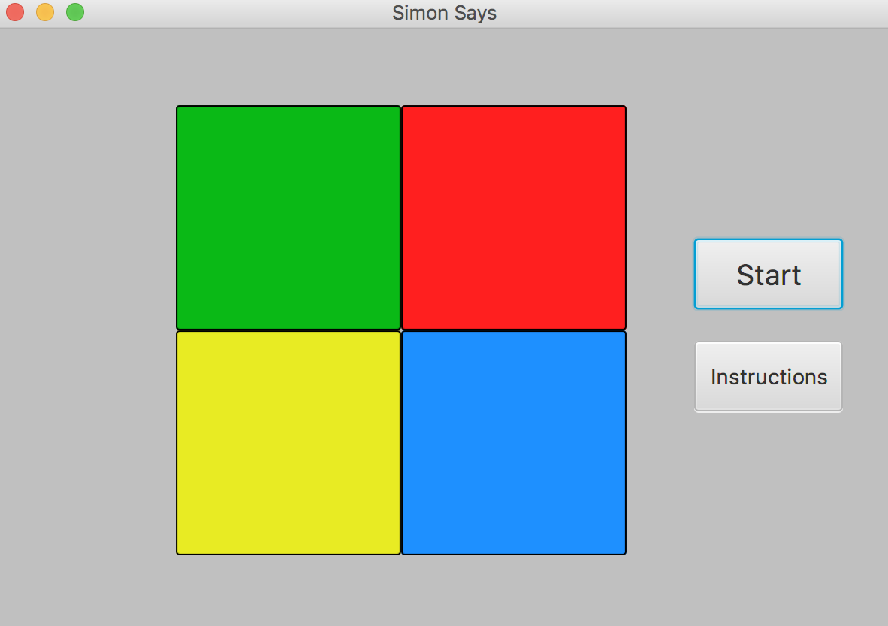

# Simon Says Game
powered by JavaFX

## Instructions to Play
Download the Jar File called SimonSays.jar, and open the application. You should have Java installed in order for the game to run.

## Instructions to Download and Contribute
1. Clone the Git Project to a local repository. 
2. Make sure you have Java 1.8 installed, and have JavaFX libraries included as well. 
3. Run the Main function, and the game will begin. 

##
